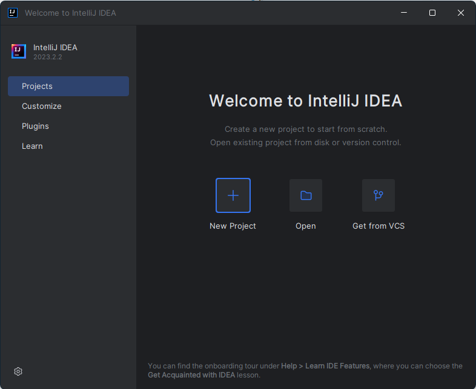
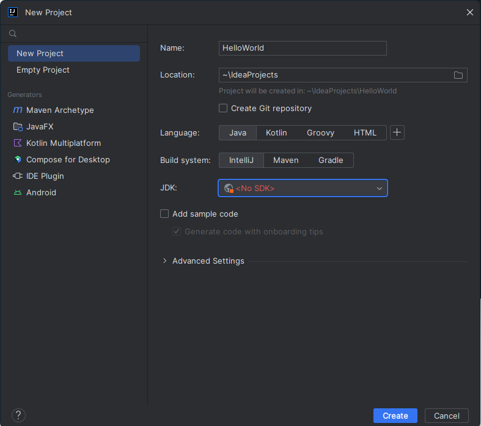
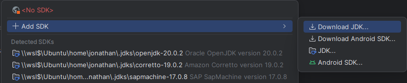
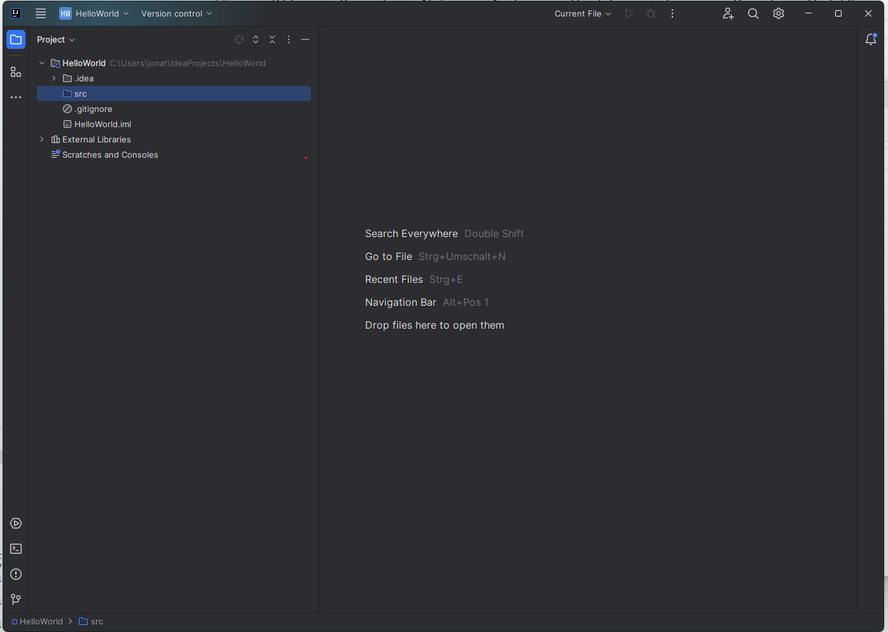
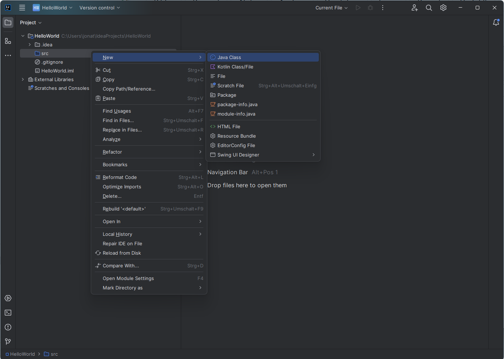
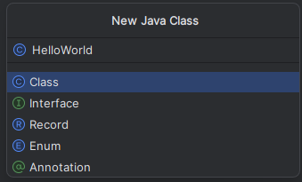
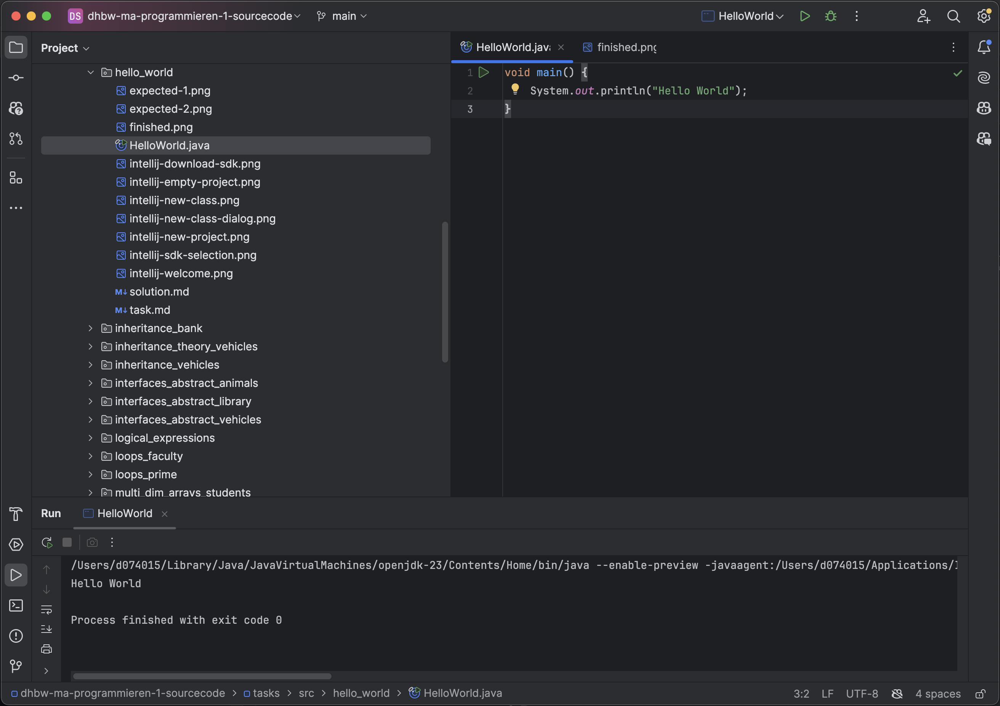
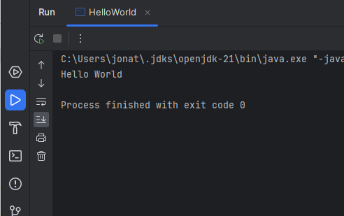
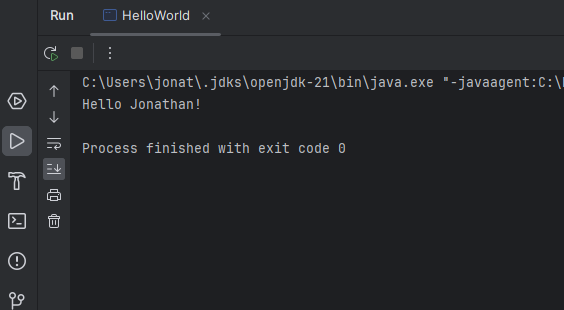

Öffne IntelliJ IDEA und erstelle ein neues Projekt.

Gebe einen Namen für das Projekt ein und wähle den Speicherort aus. Normal muss der Speicherort nicht geändert werden.
Sprache sollte Java sein.
Build System sollte auf IntelliJ bleiben.

Wähle das JDK aus, welches du für dieses Projekt verwenden möchtest. Normalerweise ist das das neuste JDK, welches du installiert hast. Wenn du dir nicht sicher bist, welches JDK du verwenden sollst, wähle das neuste aus.

Wenn noch kein SDK installiert sein sollte, klicke auf "Add SDK".

Wähle eine aktuelle Version aus und klick auf Download.
Danach kann das Projekt erstellt werden.

Wähle mit einem Rechtsklick auf den Ordner `src` die Option `New -> Java Class`.

Benenne die Klasse HelloWorld und drücke Enter.

Lösche den bereits bestehenden Code und füge nun den Hello World Code ein.

Da wir am Anfang ein experimentelles Feature mit dem Namen `Implicit Classes` verwenden, muss dieses Feature erst aktiviert werden.
Dafür hover mit der Maus über "main" und klicke auf den Button "Set language level to 23 (Preview) - ...".

Führe das Programm aus, indem du auf den grünen Pfeil neben der Main-Methode klickst.
Die folgenden Bilder zeigen, wie das Ergebnis aussehen sollte.

