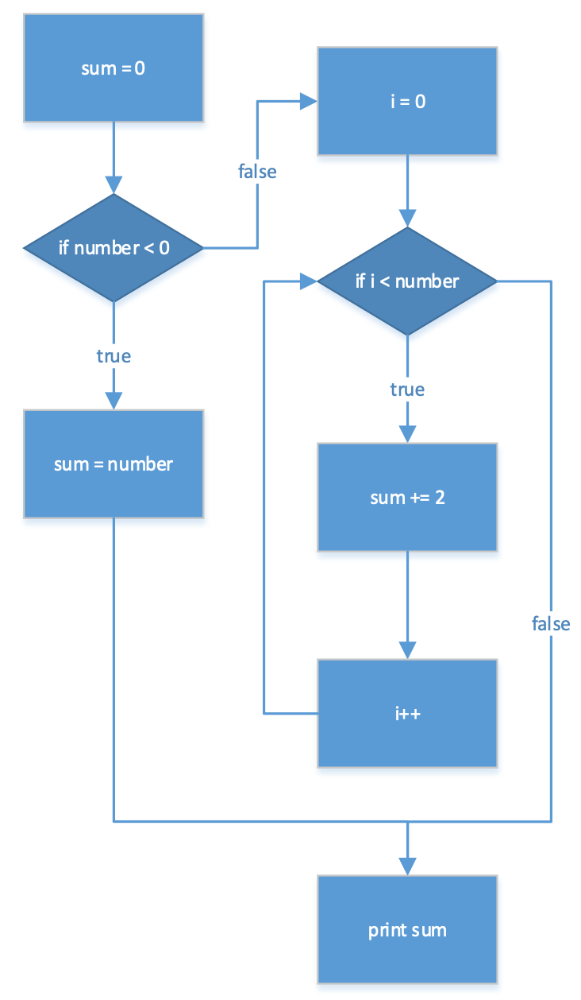

# Übungsaufgaben

## Theorie

- Geben Sie eine intuitive Beschreibung der
Endlichkeit eines Algorithmus an.

- Definieren Sie den Begriff Semantik einer
Sprache.

## Umgekehrte Worte
Schreiben Sie eine Funktion, die eine gegebene Zeichenkette nimmt und die Reihenfolge der Wörter umkehrt.

## Fibonacci Folge

Implementieren Sie eine Funktion, die die 50te Zahl der Fibonacci Folge berechnen kann.

## Ungerade Zahlen

Geben Sie alle ungeraden Zahlen bis 100 aus.

## Einheitenkonverterung
Erstellen Sie zwei Methoden, die es erlauben von Grad Celsius in Grad Fahrenheit und umgekehrt zu konvertieren.

## Zahlensystem-Konvertierung

Entwerfen Sie ein Programm, welches Dezimalzahlen in Römische Zahlen und umgekehrt konvertieren kann.

## Jede zweite Zahl

Erstellen Sie ein Programm, welches eine ungeordnetes Array von Gleitkommazahlen annimmt.
Dieses soll dann die Zahlen sortieren und jede zweite Zahl des geordneten Arrays ausgeben.

## Nur Positive Zahlen

Implementieren Sie eine Methode, die ein Array von beliebigen Zahlen annimmt und nur die positiven Zahlen ausfiltert und zurückgibt.

## Maximalzahl

Schreiben Sie ein Programm, welches aus einem Array mit Zahlen die größte Zahl ermittelt.

## Array umkehren

Entwickeln Sie ein Programm, welches ein Eingabearray umkehren kann.

## Analyse

Welche Ausgabe erzeugt folgende Methode? Welche Funktion erfüllt sie?
Was wäre ihre Ausgabe wenn der Parameter number 10 wäre?

```java
public class TestClass {
    public static void f(int number)
    {
        int count = number / 2;
        int test = 0;
        for (int i = 0; i < number; i++)  {
            count -= i;
        }
        if (count > 0) {
            test = 1;
        }
        for (int i = 1; i < number; i++) {
            if (number % i == 0) {
                System.out.println(i);
            }
        }
    }
}
```

## Programmablaufplan

Geben Sie für den folgenden Teil eines
Programmablaufplans den zugehörigen
Quellcode an:



## Weather

Eine Klasse _Weather_ soll zum Rechnen mit
Wetterdaten verwendet werden.

Die Klasse hält die Wetterdaten eines Jahres in
einem dreidimensionalen Array. 
Der erste Index bezieht sich dabei auf den Monat, der
zweite auf den Tag. Der dritte Index bezieht sich auf
die Wetterdaten. Der dritte Index 0 bezieht sich auf
die Temperatur in Grad Celsius, 1 auf die
Niederschlagsmenge in Liter.

**Beispiel**:

`weatherData[3][5][0]` gibt die Temperatur am 6.
April aus.

```java
public class Weather {
    private double[][][] weatherData; // Wetterdaten
    public Weather(double[][][] werte) {
        this.werte = werte;
    }
    
    public double yearAverage(int type)
    {
        //Aufgabenteil a)
    }
    
    public Weather convertUS()
    {
        //Aufgabenteil b)
    }
}
```

`public double yearAverage(int type):`

Diese nicht-statische Methode soll die für type = 1 die
Durchschnittstemperatur über alle Tage des Jahres
gemittelt ausgeben. Für `type = 0` soll die
durchschnittliche Niederschlagsmenge über das
gesamte Jahr gemittelt ausgegeben werden.

`public Weather convertUS()`

Diese nicht-statische Methode soll ein
neues Objekt vom Typ Weather erzeugen, welches die konvertierten Werte
des aktuellen Objektes enthält. Dabei soll die Temperatur in Fahrenheit
konvertiert werden und die Niederschlagsmenge in Gallonen.

**Umrechnung**:

Um Temperatur von Grad Celsius zu Grad Fahrenheit umzurechnen muss der
Temperaturwert mit 1,8 multipliziert werden und anschließend muss noch 32
addiert werden.

**Beispiel:**

10° Celsius entsprechen 50° Fahrenheit

Um die Niederschlagsmenge von Liter in Gallonen umzurechnen muss der
Niederschlagswert durch 3,785411784 geteilt werden.

**Beispiel:**

3,785411784 Liter entsprechen 1 Gallone
10 Liter entsprechen 2,641720524 Gallonen

## Tic-Tac-Toe

Erstellen Sie eine Klasse `TicTacToe`, 
die dazu in der Lage ist ein eigenes TicTacToe-Spiel durchzuführen. 
Die Größe des Spielfeldes kann frei gewählt werden (aber immer quadratisch!).

Beim Aufurf der Methode `startGame` soll angegebene werden können ob
zwei Menschen gegeneinander Spielen, ein Mensch gegen einen Computer-
Spieler oder zwei Computer-Spieler gegeneinander.

Der Computerspieler ist selbst zu implementieren. Dabei soll mit Hilfe der
Methode `getNextComp` der jeweils nächste Zug des Computers ermittelt
werden.

Erstellen Sie eine Klasse TicTacToeGame mit einer main-Methode, in der Sie
ihr Spiel testen.

Ihr Computer-Spieler sollte keine unerlaubten Züge durchführen.